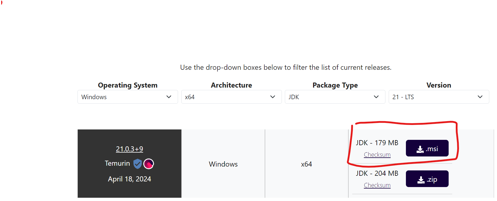

### Use the link below to download the .msi file for JDK and install it

Link : https://adoptium.net/temurin/releases/?os=windows&arch=x64&package=jdk



### After installing the JDK, Follow the path below:
1. C Drive > Program Files> Eclipse Adoptium> JDK File> bin.  <br/>
For Example my path is: `C:\Program Files\Eclipse Adoptium\jdk-21.0.3.9-hotspot\bin`
3. Copy this file path from your file explorer.
4. Open Environment Variables by searching for 'Path' in windows search.
5. Click on ` Environment Variables`.
6. Double click on path to open it.
7. Select `NEW` and paste the path you copied earlier.
8. Press okay and close path variables.
9. Open cmd and type `java -version` to check if java is installed correctly.
On successful installation, the output should look like:
```
openjdk version "21.0.3" 2024-04-16 LTS
OpenJDK Runtime Environment Temurin-21.0.3+9 (build 21.0.3+9-LTS)
OpenJDK 64-Bit Server VM Temurin-21.0.3+9 (build 21.0.3+9-LTS, mixed mode, sharing)
```
